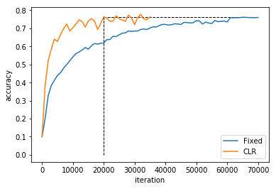
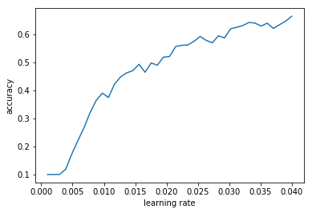

# CLR

This repository provides an implementation of the *Learning Rate Range Test* and *Cyclical Learning Rates (CLR)* as described in the paper: *Cyclical Learning Rates for Training Neural Networks* by Leslie N. Smith [1].

What's in the box?

- An implementation of the *triangular* and *triangular2* policies specified in section 3.1.
- An implementation of the *Learning Rate Range Test* described in section 3.3.
- Pytorch ports of the CIFAR10 Caffe models.
- Experiments which verify the efficacy of *CLR* combined with the *Learning Rate Range Test* in reducing training time on CIFAR10.

## Headline Result

### LR Policies

*Fixed Policy:*

|  LR | Start | End |
|---|---|---|
|  0.001| 0 | 60,000|
|  0.0001| 60,000 | 65,000|
|  0.00001| 65,000 | 70,000|

*CLR Policy (triangular):*

|  Step Size | Min LR | Max LR | Start | End |
|---|---|---|---|---|---|
|  2000| 0.0025 | 0.01| 0 | 35,000

*Fixed vs CLR Training Result:*

|  LR Policy | Iterations | Accuracy (%)|
|---|---|---|---|---|
|  *fixed* | 70,000  | 76.4 |
|  *CLR (triangular policy)* | **20,000**  | 76.4 |

- The CLR policy achieves the same accuracy in 20,000 iterations as that obtained by the fixed policy in 70,000:

*Learning Rate Range Test*

- The lower boundry for the CLR policy is ~0.0025, where the accuracy starts to increase.
- A upper boundry for the CLR policy is ~0.01, where the plot becomes ragged.

## References

[1] Leslie N. Smith. Cyclical Learning Rates for Training Neural Networks. [arXiv:1506.01186](https://arxiv.org/pdf/1506.01186.pdf), 2015.