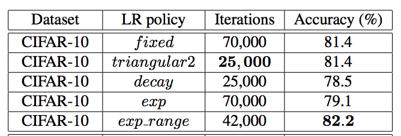

# CLR

This repository provides an implementation of the paper: *Cyclical Learning Rates for Training Neural Networks* by Leslie N. Smith [1]. 

## Contents

- An implementation of the *triangular* and *triangular2* policies specified in section 3.1 and a reproduction of the experiment described in that section and section 4.1.
- An implementation of the *Learning Rate Range Test* described in section 3.3 and a reproduction of the experiment in that section on the CIFAR10 dataset.

## Results

## Notes

## Instructions

## References

[1] Leslie N. Smith. Cyclical Learning Rates for Training Neural Networks. [arXiv:1506.01186](https://arxiv.org/pdf/1506.01186.pdf), 2015.