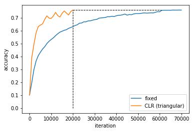

# CLR

This repository provides an implementation of the *Learning Rate Range Test* and *Cyclical Learning Rates (CLR)* as described in the paper: *Cyclical Learning Rates for Training Neural Networks* by Leslie N. Smith [1].

What's in the box?

- An implementation of the *triangular* and *triangular2* policies specified in section 3.1.
- An implementation of the *Learning Rate Range Test* described in section 3.3.
- Pytorch ports of the CIFAR10 Caffe models.
- Experiments which verify the efficacy of *CLR* combined with the *Learning Rate Range Test* in reducing training time on CIFAR10.

## Headline Result

|  LR Policy | Iterations | Accuracy (%)|
|---|---|---|---|---|
|  *fixed* | 70,000  | 76.4 |
|  *CLR (triangular policy)* | **20,000**  | 76.4 |

## Other Results

TODO - note results from experiments

First hack results

|  LR Policy | Iterations | Reported Accuracy (%)| Accuracy (%)| Diff (%)|
|---|---|---|---|---|
|  *fixed* | 70,000  | 81.4  | 76.0 | 5.4 |
|  *triangular 2* | **25,000**  |  81.4 | 74.5 | 6.9 |
|  *decay* |  25,000 | 78.5  | 72.0 |6.5 |
|  *exp* | 70,000  | 79.1  | 68.7  | 10.4 |
|  *exp_range* | 42,000  | 82.2  | 75.7 | 6.5 |

Cifar10Net_quick
- with ported caffe `mult` parameters.

|  LR Policy | Iterations | Accuracy (%)|
|---|---|---|---|---|
|  *fixed* | 70,000  |  |
|  *exp* | 70,000 | |
|  *triangular* |   |  |
|  *triangular2* |   |  |
|  *decay* |   |  |
|  *exp_range* |   |  |

Cifar10Net_quick
- w/o ported caffe `mult` parameters.

|  LR Policy | Iterations | Accuracy (%)|
|---|---|---|---|---|
|  *fixed* | 70,000  | |
|  *exp* | 70,000 | |
|  *triangular* |   |  |
|  *triangular2* |  |  |
|  *decay* |  |  |
|  *exp_range* |   |  |

## Instructions

TODO - dev instructions to build / run / test

## Notes

TODO - write up

- decay policy hyper-params in 4.1.1
- p1: reference architecture not precisely specified
- local response normalisation: 3.1.1 of http://www.cs.toronto.edu/~fritz/absps/imagenet.pdf, within_channel not supported by pytorch
- bias / weight lr_mult differential lr unusual + no literature online
- weight_decay mult huge in last layer - prevents training?
- initialisation - can’t train with specified config
- full model has fewer params than quick model, which seems odd.

## References

[1] Leslie N. Smith. Cyclical Learning Rates for Training Neural Networks. [arXiv:1506.01186](https://arxiv.org/pdf/1506.01186.pdf), 2015.