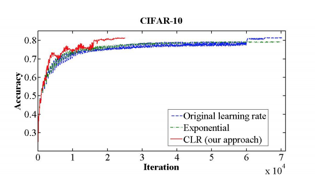

# CLR

This repository provides an implementation of the paper: *Cyclical Learning Rates for Training Neural Networks* by Leslie N. Smith [1]. 

## TL;DR

TODO

## Contents

- An implementation of the *triangular* and *triangular2* policies specified in section 3.1.
- An implementation of the *Learning Rate Range Test* described in section 3.3.
- Pytorch ports of the CIFAR10 Caffe models.
- Reproductions of experiments which verify the efficacy of CLR in reducing training time.

## Results

__UNDER_CONSTRUCTION__

First hack results

|  LR Policy | Iterations | Reported Accuracy (%)| Accuracy (%)| Diff (%)|
|---|---|---|---|---|
|  *fixed* | 70,000  | 81.4  | 76.0 | 5.4 |
|  *triangular 2* | **25,000**  |  81.4 | 74.5 | 6.9 |
|  *decay* |  25,000 | 78.5  | 72.0 |6.5 |
|  *exp* | 70,000  | 79.1  | 68.7  | 10.4 |
|  *exp_range* | 42,000  | 82.2  | 75.7 | 6.5 |

Cifar10Net_quick
- with ported caffe `mult` parameters.

|  LR Policy | Iterations | Accuracy (%)|
|---|---|---|---|---|
|  *fixed* | 70,000  |  |
|  *exp* | 70,000 | |
|  *triangular* |   |  |
|  *triangular2* |   |  |
|  *decay* |   |  |
|  *exp_range* |   |  |

Cifar10Net_quick
- w/o ported caffe `mult` parameters.

|  LR Policy | Iterations | Accuracy (%)|
|---|---|---|---|---|
|  *fixed* | 70,000  | |
|  *exp* | 70,000 | |
|  *triangular* |   |  |
|  *triangular2* |  |  |
|  *decay* |  |  |
|  *exp_range* |   |  |

## Instructions

## Notes

## References

[1] Leslie N. Smith. Cyclical Learning Rates for Training Neural Networks. [arXiv:1506.01186](https://arxiv.org/pdf/1506.01186.pdf), 2015.